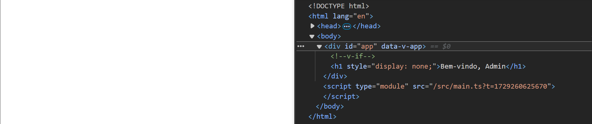
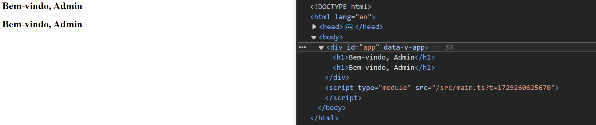

<h1 align="center"><code>v-show</code></h1>

Tem a mesma função de um `v-if`, mas com uma diferença, ao utilizar `v-show`, o elemento que terá a condição, existirá na árvore do DOM, o que fará o elemento ser exibido em tela, será a mudança de sua propriedade `display` no CSS.

## Exemplo

```html
<h1 v-show="adminPage">Bem-vindo, Admin</h1>
```

## `v-if` VS `v-show` na prática

Temos o seguinte código:

```html
<template>
  <h1 v-if="adminPage">Bem-vindo, Admin</h1>
  <h1 v-show="adminPage">Bem-vindo, Admin</h1>
</template>

<script setup lang="ts">
import { ref } from 'vue';

const adminPage = ref(false)
</script>
```

<br>

Podemos notar que `adminPage` é `false`, portanto, os títulos não aparecerão em tela.

Porém, `v-show` mantém o elemento na árvore do DOM:



<br>

Agora, se mudarmos `adminPage` para `true`, os elementos são renderizados.


